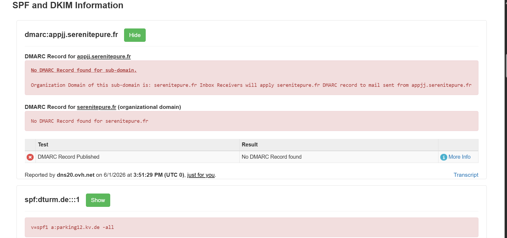

# Internship Task 2: Phishing Email Sample Analysis

## Objective
The primary goal of this task is to identify and document phishing characteristics in a suspicious email sample using header analysis and behavioral observation techniques to improve threat detection and security awareness.

---

## Technical Artifact Verification
* **Analyzed File:** `sample-100.eml`
* **Analysis Tool:** MxToolbox Email Header & Domain Analyzer

### Header Analyzer Results Verification
Below are the verification screenshots mapping the technical anomalies discovered across the email metadata and domain authentication lookups:

#### Part 1: Raw Header Analysis (`analyzer_results.png`)

#### Part 2: Domain Security Records (`analyzer_results2.png`)

---

## 1. Technical Header Analysis & Authentication Failures

A deep dive into the routing infrastructure reveals clear evidence of identity concealment, infrastructure spoofing, and a complete lack of organizational security controls:

* **From vs. Return-Path Mismatch:** The displayed sender claims to be `"Zonnepanelen installateur" <zonnepaneel@appjj.serenitepure.fr>`[cite: 2]. However, the actual originating return infrastructure maps to `Return-Path: return@dturm.de`[cite: 2].
* **The Reply-To Trap:** If a target user attempts to reply to the email, the message bypasses the sender domain entirely and routes directly to an independent address: `news@aichakandisha.com`[cite: 2].
* **SPF Domain Restriction Verification:** As verified in `analyzer_results2.png`, the true sending domain `dturm.de` publishes a highly restrictive SPF record (`v=spf1 a:parking12.kv.de -all`). Because the email was sent from IP `57.128.69.202`[cite: 2] (which is not `parking12.kv.de`), it triggers a hard validation failure. This is why the receiving gateway flagged `Received-SPF: None` and noted that `dturm.de does not designate permitted sender hosts`[cite: 2].
* **Total Absence of DMARC:** As documented in `analyzer_results2.png`, an explicit lookup for both the sub-domain (`appjj.serenitepure.fr`) and the organizational domain (`serenitepure.fr`) returns a critical vulnerability: **"No DMARC Record found"**. Without a DMARC policy, the domain owner has zero visibility or control over malicious actors spoofing their identity[cite: 1].
* **Lack of DKIM Signature:** The header notes `dkim=none (message not signed)`[cite: 2]. The message lacks a cryptographic signature to prove its integrity[cite: 1, 2].
* **Composite Authentication Verdict:** Lacking proper signatures and failing alignment, the core gateway security controls triggered an explicit validation failure: `compauth=fail reason=001`[cite: 2].
* **Spam Classification:** Microsoft's filtering engine stamped this message with an `SCL: 5` (Spam Confidence Level)[cite: 2], automatically routing the threat to the Junk folder (`dest: J; RF:JunkEmail`)[cite: 2].

---

## 2. Content & Social Engineering Tactics

* **The Bait:** The subject line targets victims using a deceptive financial incentive written in Dutch: `Zonnepanelen voor een goede prijs` (*Solar panels for a good price*)[cite: 2].
* **Psychological Triggers:** The email exploits current economic anxieties regarding inflation and volatile utility markets[cite: 1]:
  * *"Enough of soaring electricity and gas bills?"*[cite: 2]
  * *"Spending less on fun things due to inflation?"*[cite: 2]
* **Scarcity & Urgency:** The closer applies artificial psychological pressure to bypass critical thinking[cite: 1]: *"More and more solar panel companies can no longer handle the large influx of customers. Therefore, do not wait any longer and sign up now!"*[cite: 2]

---

## 3. Link Verification (Mismatched URLs)

* **Deceptive Anchor Text:** The hyperlinks inside the HTML payload explicitly try to look legitimate by referencing the trusted Dutch Consumer Association (*Consumentenbond*)[cite: 2].
* **True Redirection Target:** Inspecting the raw HTML code reveals that every single text link and call-to-action button actually points to a tracking network domain: `http://go.nltrck.com/?c=495&source=consumentenbond...`[cite: 2] designed to farm user interactions and collect profiling data[cite: 1].

---

## Conclusion & Threat Assessment
Based on the absolute failure of email authentication standards (SPF Fail, missing DKIM, and absent DMARC records), the stark domain discrepancies across From/Reply-To/Return-Path fields[cite: 2], and the deceptive tracking URLs hidden behind reputable brand text[cite: 2], this sample is classified as a **Malicious Tracking & Click-Farming Phishing Campaign**.

---

## Interview Questions & Answers

### 1. What is phishing?
Phishing is a form of social engineering where malicious actors masquerade as trustworthy entities via digital communications to trick victims into revealing sensitive credentials, installing malware, or executing unauthorized financial transfers[cite: 1].

### 2. How to identify a phishing email?
Key technical indicators include mismatched sender/return paths, failed SPF/DKIM/DMARC authentication parameters, hyper-generic greetings, urgent or threatening language, spelling/grammar anomalies, and hidden links targeting unverified external tracking domains[cite: 1].

### 3. What is email spoofing?
Email spoofing is the intentional forgery of an email header (specifically the `From:` line) so that the incoming message appears to have originated from a legitimate, trusted domain rather than the malicious server that actually sent it[cite: 1].

### 4. Why are phishing emails dangerous?
They exploit human psychological vulnerabilities directly, enabling attackers to bypass perimeter technical firewalls[cite: 1]. A successful attack can result in critical corporate credential harvesting, massive ransomware deployment, and severe data breaches[cite: 1].

### 5. How can you verify the sender's authenticity?
Authenticity is verified by checking the raw email headers to see if the sending IP address passes SPF validation, verifying the DKIM cryptographic public-key handshake, and checking DMARC alignment criteria matching the visible domain[cite: 1].

### 6. What tools can analyze email headers?
Prominent industry tools include Google Admin MessageHeader, MxToolbox Email Header Analyzer, Mailheader.org, and Microsoft Message Header Analyzer[cite: 1].

### 7. What actions should be taken on suspected phishing emails?
Users should immediately avoid interacting with links or executing file attachments[cite: 1]. The email should be isolated, reported to the corporate Security Operations Center (SOC) or IT department via standard phishing reporting integrations, and subsequently purged or quarantined[cite: 1].

### 8. How do attackers use social engineering in phishing?
Attackers weaponize human emotions such as panic, greed, curiosity, or deference to authority[cite: 1]. By manufacturing a crisis scenario (e.g., "Account suspended") or an urgent legal obligation, they force the victim into making impulsive, dangerous compliance decisions[cite: 1].
