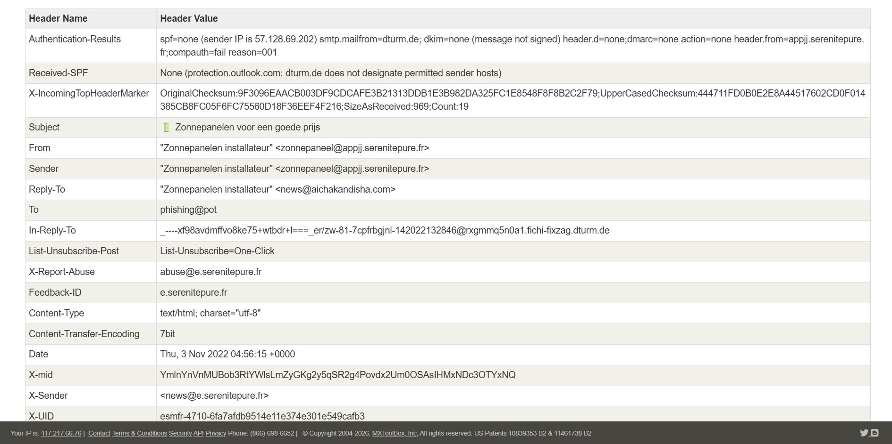

# Internship Task 2: Phishing Email Sample Analysis

## Objective
The primary goal of this task is to identify and document phishing characteristics in a suspicious email sample using header analysis and behavioral observation techniques to improve threat detection and security awareness.

---

## Technical Artifact Verification
* **Analyzed File:** `sample-100.eml`
* **Analysis Tool:** MxToolbox Email Header Analyzer

### Header Analyzer Results Verification
Below is the verification screenshot mapping the technical anomalies discovered in the message headers:

---

## 1. Technical Header Analysis & Authentication Failures

A deep dive into the routing infrastructure reveals clear evidence of identity concealment and infrastructure spoofing:

* **From vs. Return-Path Mismatch:** The displayed sender claims to be `"Zonnepanelen installateur" <zonnepaneel@appjj.serenitepure.fr>`. However, the actual originating return infrastructure maps to `Return-Path: return@dturm.de`.
* **The Reply-To Trap:** If a target user attempts to reply to the email, the message bypasses the sender domain entirely and routes directly to an independent address: `news@aichakandisha.com`.
* **SPF Failure:** The analyzer explicitly records `Received-SPF: None (protection.outlook.com: dturm.de does not designate permitted sender hosts)`. The sending server IP (`57.128.69.202`) is unauthorized to dispatch emails on behalf of the domain.
* **Lack of DKIM Signature:** The header notes `dkim=none (message not signed)`. The message lacks a cryptographic signature to prove its integrity.
* **Composite Authentication Verdict:** The core gateway security controls triggered an explicit validation failure: `compauth=fail reason=001`.
* **Spam Classification:** Microsoft's filtering engine stamped this message with an `SCL: 5` (Spam Confidence Level), automatically routing the threat to the Junk folder (`dest: J; RF:JunkEmail`).

---

## 2. Content & Social Engineering Tactics

* **The Bait:** The subject line targets victims using a deceptive financial incentive written in Dutch: `Zonnepanelen voor een goede prijs` (*Solar panels for a good price*).
* **Psychological Triggers:** The email exploits current economic anxieties regarding inflation and volatile utility markets:
  * *"Enough of soaring electricity and gas bills?"*
  * *"Spending less on fun things due to inflation?"*
* **Scarcity & Urgency:** The closer applies artificial psychological pressure to bypass critical thinking: *"More and more solar panel companies can no longer handle the large influx of customers. Therefore, do not wait any longer and sign up now!"*

---

## 3. Link Verification (Mismatched URLs)

* **Deceptive Anchor Text:** The hyperlinks inside the HTML payload explicitly try to look legitimate by referencing the trusted Dutch Consumer Association (*Consumentenbond*).
* **True Redirection Target:** Inspecting the raw HTML code reveals that every single text link and call-to-action button actually points to a tracking network domain: `http://go.nltrck.com/?c=495&source=consumentenbond...` designed to farm user interactions and collect profiling data.

---

## Conclusion & Threat Assessment
Based on the absolute failure of email authentication standards (SPF/DKIM/CompAuth Fail), the stark domain discrepancies across From/Reply-To/Return-Path fields, and the deceptive tracking URLs hidden behind reputable brand text, this sample is classified as a **Malicious Tracking & Click-Farming Phishing Campaign**.
